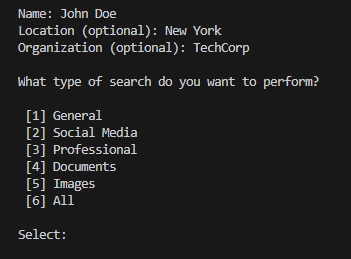
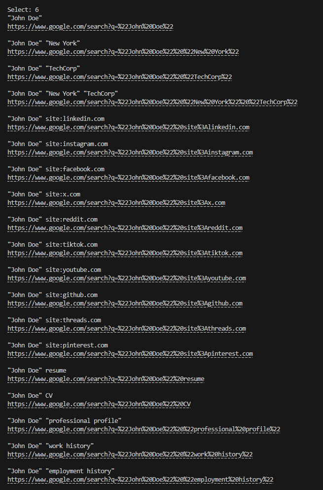

# OQForge

A Python-based OSINT query builder for generating targeted search queries for people, usernames, emails, phone numbers, companies, and domains.

**Note: OQForge is currently a work in progress. Some features and functionality may be incomplete and are subject to change.**

## Features

* Person search queries
* Username search queries
* Email search queries
* Phone number search queries
* Company search queries
* Domain search queries
* Multiple search categories

## Technologies Used

* Python
* Git
* GitHub

## Installation

1. Have Python 3 installed
2. Clone this repository
3. Run: ```python oqforge.py```
  
## Usage

Choose the type of search query you want from the main menu. Enter the requested information, then select a search category. OQForge will generate different search queries based on your selections, with links that open the generated queries directly in a web browser. To make things more efficient, each generated query is displayed above the link so you can see what each link will open. 

## Screenshots

### Main Menu


### Person Search Menu


### Generated Queries


## Future Features/Improvements

* Implement custom search functionality
* Cleaner output
* Option to save output of queries into a file
* Better output formatting

**If you have any suggestions to improve this project or to have a feature added, please let me know! I'm open to them and will consider them.**

## Disclaimer

OQForge is intended for educational purposes and authorized OSINT research only.
